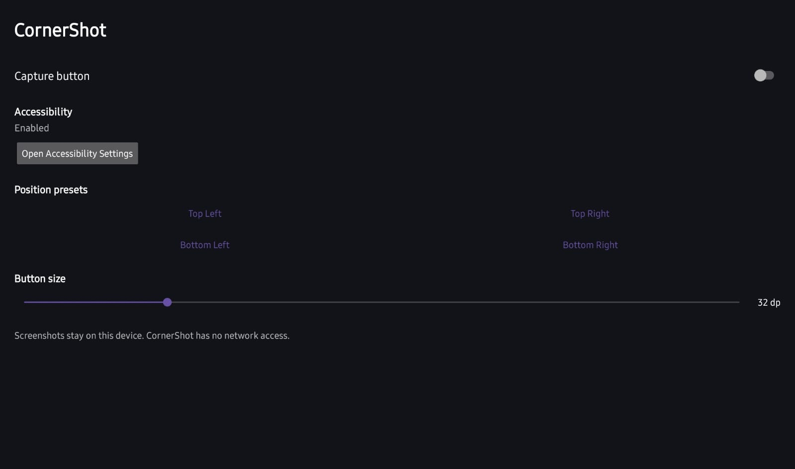
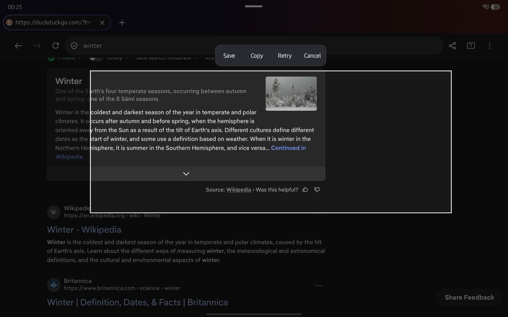

# CornerShot

<table>
  <tr>
    <th align="center">Settings</th>
    <th align="center">Select and crop</th>
  </tr>
  <tr>
    <td></td>
    <td></td>
  </tr>
</table>

CornerShot is a lightweight Android screenshot cropping tool. Tap its floating button while using another app, select a rectangle from the frozen screenshot, then save or copy the crop.

## Features

- Captures the current display with Android's `AccessibilityService.takeScreenshot()` API.
- Shows an iconless floating circle above other apps. A quick tap captures; long-press and drag moves it freely.
- Adjusts the visible button diameter from 24dp to 64dp in 2dp steps. The transparent touch target stays at least 48dp.
- Stores the button's position relative to the usable display area, so it remains sensibly placed after rotation or display-size changes.
- Offers four corner position presets as well as free placement.
- Supports finger and S Pen selection, with **Save**, **Copy**, **Retry**, and **Cancel** actions.

## Get started

1. Open CornerShot and turn on **Capture button**.
2. If prompted, open Android Accessibility Settings and enable **CornerShot screenshot button**. Return to CornerShot.
3. Optionally choose a position preset or adjust **Button size**. You can also reposition the floating circle later by long-pressing and dragging it.
4. Switch to the app you want to capture and tap the floating circle. CornerShot hides the circle before capturing, then displays the screen as a frozen image.
5. Drag a rectangle and choose an action from the selection menu.

**Save** writes a PNG to `Pictures/Screenshots`, named `CornerShot_yyyyMMdd_HHmmss_SSS.png`.

**Copy** puts the crop on the clipboard as image content without saving it to Pictures. Its local cache file is retained for up to seven days and bounded by a cache size limit.

**Retry** clears the rectangle and lets you select again from the same frozen screenshot. **Cancel** discards the selection. Back clears an active selection or exits the capture screen when no selection is active.

## Privacy and Accessibility

Screenshots are processed locally and remain on the device unless you choose to save or copy a crop. CornerShot has no `INTERNET` permission and includes no network access, accounts, ads, analytics, telemetry, cloud sync, or remote assets.

Android requires an enabled AccessibilityService for screenshot capture and the `TYPE_ACCESSIBILITY_OVERLAY` floating button. CornerShot uses Accessibility access only to take a screenshot after you tap its button and to display that button. It does not inspect accessibility content, retrieve window content, inject gestures, or filter keys. Its service configuration sets `canTakeScreenshot=true` and `canRetrieveWindowContent=false`.

Android prevents screenshots of apps or windows marked secure with `FLAG_SECURE`. CornerShot reports the failure and does not attempt to bypass this restriction.

## Build

The project uses Kotlin/JVM 17, Gradle 8.13, Android Gradle Plugin 8.13.0, and Android SDK Platform 36. With JDK 17 and Android SDK Platform 36 installed, build the debug APK from the project root:

```sh
./gradlew :app:assembleDebug
```
