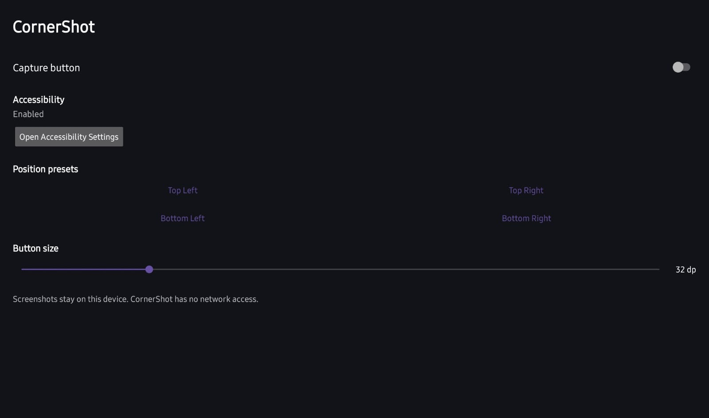
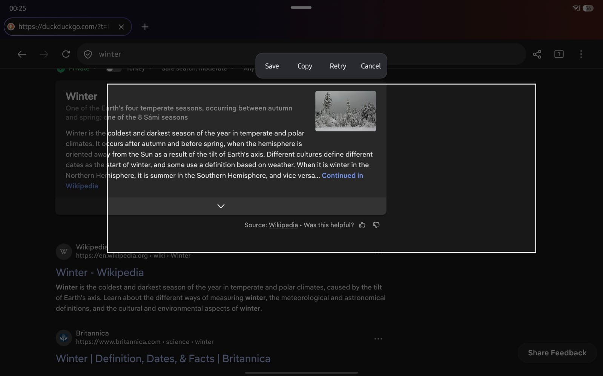

# CornerShot

CornerShot is a small Android app for capturing and cropping part of the screen. A floating button starts a capture; draw a rectangle over the frozen image, then save the crop or copy it to the clipboard.

| Settings | Select and crop |
| --- | --- |
|  |  |

## Features

- Uses Android's `AccessibilityService.takeScreenshot()` API to capture the display.
- Shows a floating circle above other apps. Tap it to capture; long-press and drag it to move it.
- Set the visible button diameter from 24 dp to 64 dp, in 2 dp steps. Its touch target stays at least 48 dp.
- Choose a corner preset or place the button freely. Its position is saved relative to the usable display area and adapts to rotation and display-size changes.
- Select a crop with a finger or S Pen, then **Save**, **Copy**, **Retry**, or **Cancel**.

## Use CornerShot

1. Install and open CornerShot.
2. Turn on **Capture button**. When prompted, enable **CornerShot screenshot button** in Android Accessibility Settings, then return to the app.
3. Optionally set a corner preset or button size. Move the button by long-pressing and dragging it.
4. Open the screen you want to capture and tap the floating button. CornerShot hides the button while it captures, then opens the screenshot for selection.
5. Drag over the area to crop and choose an action.

**Save** writes a PNG to `Pictures/Screenshots`, named `CornerShot_yyyyMMdd_HHmmss_SSS.png`. **Copy** places the crop on the clipboard as image content; its temporary cache file is retained for up to seven days and bounded by a cache size limit. **Retry** clears the selection on the same captured image. **Cancel** discards it. Back clears an active selection or exits the capture screen when no selection is active.

## Privacy and permissions

Screenshots are processed locally and stay on the device unless you save or copy a crop. CornerShot has no `INTERNET` permission and includes no accounts, ads, analytics, telemetry, cloud sync, or remote assets.

Android requires an enabled Accessibility service for screenshot capture and the floating button. CornerShot uses this access to capture only after you tap the button and to display the button. It does not read accessibility content, inject gestures, or filter keys. The service allows screenshots but does not allow retrieval of window content. Android blocks screenshots of secure windows (`FLAG_SECURE`); CornerShot reports the failure and does not bypass that restriction.

## Build

Requirements: JDK 17 and Android SDK Platform 36. The project uses Gradle 8.13, Android Gradle Plugin 8.13.0, Kotlin 2.2.20, and targets Android 16 (API 36).

Build the debug APK from the project root:

```sh
./gradlew :app:assembleDebug
```

The Gradle output is `app/build/outputs/apk/debug/app-debug.apk`. To reproduce the versioned release artifact in the project root:

```sh
cp app/build/outputs/apk/debug/app-debug.apk CornerShot-v0.1.0.apk
```

Run the unit tests with `./gradlew :app:testDebugUnitTest`.
